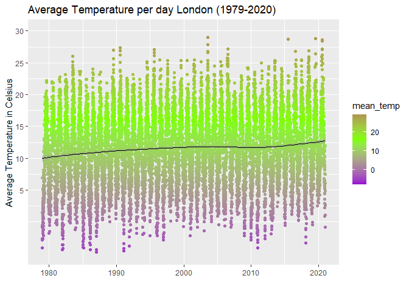
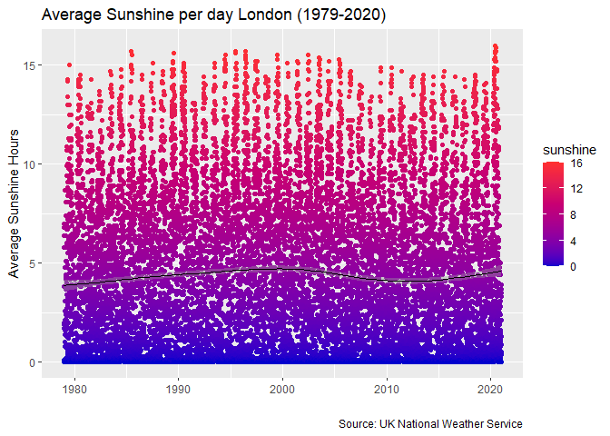
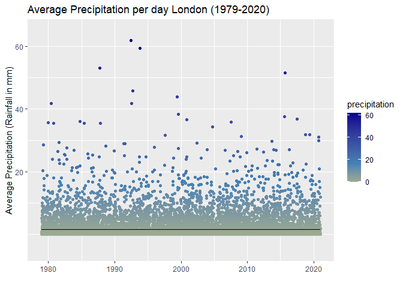
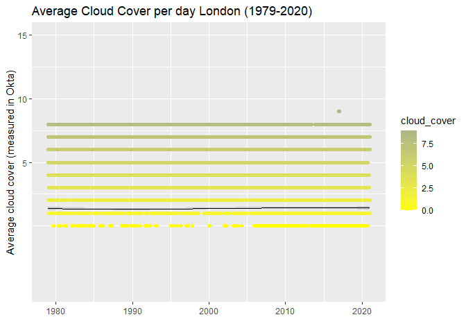
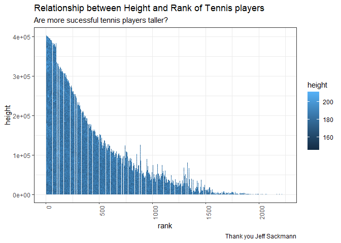
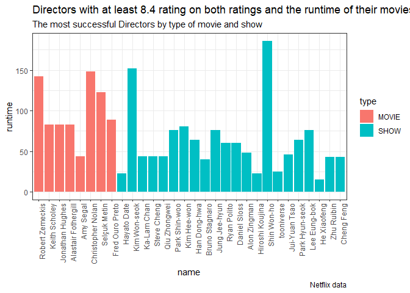
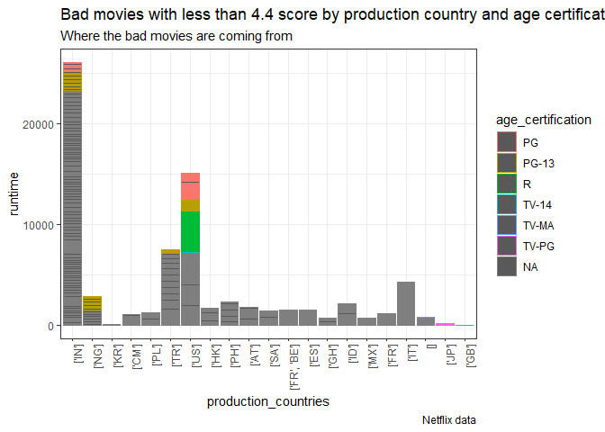

# Purpose

Purpose of this work folder.

Ideally store a minimum working example data set in data folder.

Add binary files in bin, and closed R functions in code. Human Readable
settings files (e.g. csv) should be placed in settings/

``` r
#rm(list = ls()) # Clean your environment:
gc() # garbage collection - It can be useful to call gc after a large object has been removed, as this may prompt R to return memory to the operating system.
```

    ##          used (Mb) gc trigger (Mb) max used (Mb)
    ## Ncells 444797 23.8     948925 50.7   643845 34.4
    ## Vcells 793768  6.1    8388608 64.0  1649465 12.6

``` r
library(tidyverse)
```

    ## -- Attaching packages --------------------------------------- tidyverse 1.3.1 --

    ## v ggplot2 3.3.6     v purrr   0.3.4
    ## v tibble  3.1.6     v dplyr   1.0.9
    ## v tidyr   1.2.0     v stringr 1.4.0
    ## v readr   2.1.2     v forcats 0.5.1

    ## -- Conflicts ------------------------------------------ tidyverse_conflicts() --
    ## x dplyr::filter() masks stats::filter()
    ## x dplyr::lag()    masks stats::lag()

``` r
list.files('code/', full.names = T, recursive = T) %>% .[grepl('.R', .)] %>% as.list() %>% walk(~source(.))
```

``` r
fmxdat::make_project(Open = T)

 CHOSEN_LOCATION <- "C:/Users/Erik Schulte/ownCloud/Uni Göttingen/Stellenbosch University/Data Science Methods/26802325/"
fmxdat::make_project(FilePath = glue::glue("{CHOSEN_LOCATION}Solution/"), 
                    ProjNam = "___26802325")

Texevier::create_template_html(directory = glue::glue("{CHOSEN_LOCATION}Solution/"), template_name = "Q1")
Texevier::create_template_html(directory = glue::glue("{CHOSEN_LOCATION}Solution/"), template_name = "Q2")
Texevier::create_template_html(directory = glue::glue("{CHOSEN_LOCATION}Solution/"), template_name = "Q3")
Texevier::create_template(directory = glue::glue("{CHOSEN_LOCATION}Solution/"), template_name = "Q4")
```

# Question 1 Solution

``` r
# Data loading:
    Loc <- "data/Prac2022/Covid/"
    cov_description <- read.csv(glue::glue("{Loc}covid_data_description.csv"))
    deaths_cause <- read.csv(glue::glue("{Loc}Deaths_by_cause.csv"))
    owid_data <- read.csv(glue::glue("{Loc}owid-covid-data.csv"))
    library(tidyverse)
library(ggplot2)
library(dplyr)
```

``` r
gg <- cases_per_region(continents,  xaxis_size = 5, xaxis_rows = 3)
gg
#
```

We can see that as of this week Africa had by far the fewest total cases
compared to the other continents in the dataframe. Less than 15 Million
COVID cases, where as Other regions like the US and Europe and Asia had
more than 100 million cases or well above. But obviously this has
multiple reasons like different populations sizes and testing
capacities.

``` r
ggg <- deaths_per_region(continents,  xaxis_size = 5, xaxis_rows = 3)
ggg
#
```

We can further see that this is also reflected in the deaths per region
Africa is the only continent with less than 500,000 deaths related to
COvid while all other continents had at least 1 Million so far. There is
definetely a corrleation between cases and total deaths in the regions.

``` r
# summary(owid_data$female_smokers)
# summary(owid_data$aged_65_older)
```

First, of all we not that theere is very little data on ICU admissions
and patients since the vast majority is NA’s as the summary command
shows.

``` r
# <- owid_data[owid_data$iso_code %in% c("OWID_AFR", "OWID_ASI", "OWID_EUR", "OWID_NAM", "OWID_SAM"),] 
#no data available for OWID continents...
###add lagged ICU admissions
# summary(owid_data$icu_patients) 
# summary(owid_data$weekly_icu_admissions_per_million)
# unique(owid_data$icu_patients)

##regressions does not work
#regressions <- lm(formuala = lagged_ICU_patients ~ hospital_beds_per_thousand, data = owid_data)
```

# Question 2 Solution

``` r
# Data loading:
library(readr)
library(lubridate)
```

    ## 
    ## Attache Paket: 'lubridate'

    ## Die folgenden Objekte sind maskiert von 'package:base':
    ## 
    ##     date, intersect, setdiff, union

``` r
london_weather <- read_csv("data/Prac2022/London/london_weather.csv", col_types = cols(date = col_date(format = "%Y%m%d")))
```

# Overview and summarising table

``` r
#summary(london_weather)
library(stargazer)
```

    ## 
    ## Please cite as:

    ##  Hlavac, Marek (2022). stargazer: Well-Formatted Regression and Summary Statistics Tables.

    ##  R package version 5.2.3. https://CRAN.R-project.org/package=stargazer

``` r
library(dplyr)
london_weather |> select(cloud_cover, sunshine, global_radiation, max_temp, mean_temp, min_temp, precipitation, pressure, snow_depth)|> stargazer(type = "text")
```

    ## 
    ## =================================
    ## Statistic N Mean St. Dev. Min Max
    ## =================================

The table created by stargazer package shows the summary statistics of
the london weather data. The mean temperature is 11.48 degrees celsius
for example and precipitation is 1.66mm per day. On average there are
4.35 sunshine hours per day.

# Some plots that demonstate London’s bad wheather

## Temperature

``` r
g1 <- plot_avg_temp(london_weather)
g1
```

    ## `geom_smooth()` using method = 'gam' and formula 'y ~ s(x, bs = "cs")'

<div class="figure" style="text-align: center">


<p class="caption">
Average Temperature
</p>

</div>

##Sun

``` r
g2 <- plot_sunshine(london_weather)
g2
```

    ## `geom_smooth()` using method = 'gam' and formula 'y ~ s(x, bs = "cs")'

<div class="figure" style="text-align: center">


<p class="caption">
Average Sunshine
</p>

</div>

##Rain

``` r
g3 <- plot_avg_precipitation(london_weather)
g3
```

    ## `geom_smooth()` using method = 'gam' and formula 'y ~ s(x, bs = "cs")'

<div class="figure" style="text-align: center">


<p class="caption">
Average rainfall
</p>

</div>

##Clouds

``` r
g4 <- plot_cloudy(london_weather)
g4
```

    ## `geom_smooth()` using method = 'gam' and formula 'y ~ s(x, bs = "cs")'

<div class="figure" style="text-align: center">


<p class="caption">
Average Cloud COver
</p>

</div>

It am sure that my high school friend is convinced about my graphs and
will stay in beautiful South Africa.

# Question 3 Solution

``` r
datcolatplayers <- Data_Collating(Datroot = "data/Prac2022/players/")  
datcolat1 <- Data_Collating(Datroot = "data/Prac2022/rankings/")   

#rename matching variable
datcolat1 <- rename(datcolat1, player_id = player)

#now matched players and the ranking....
playerranking <- merge(datcolat1,datcolatplayers,by="player_id")

#datcolat2 <- Data_Collating(Datroot = "data/Tennis_single_atp/")   
library(readr)
atp_matches_2000 <- read_csv("~/ownCloud/Uni Göttingen/Stellenbosch University/Data Science Methods/26802325/Solution/Q3/data/Tennis/atp_matches_2000.csv")
```

    ## Rows: 3378 Columns: 49
    ## -- Column specification --------------------------------------------------------
    ## Delimiter: ","
    ## chr (14): tourney_id, tourney_name, surface, tourney_level, winner_entry, wi...
    ## dbl (35): draw_size, tourney_date, match_num, winner_id, winner_seed, winner...
    ## 
    ## i Use `spec()` to retrieve the full column specification for this data.
    ## i Specify the column types or set `show_col_types = FALSE` to quiet this message.

``` r
View(atp_matches_2000)
atp_matches_2022 <- read_csv("~/ownCloud/Uni Göttingen/Stellenbosch University/Data Science Methods/26802325/Solution/Q3/data/Tennis/atp_matches_2022.csv")
```

    ## Rows: 1490 Columns: 49
    ## -- Column specification --------------------------------------------------------
    ## Delimiter: ","
    ## chr (16): tourney_id, tourney_name, surface, tourney_level, winner_seed, win...
    ## dbl (33): draw_size, tourney_date, match_num, winner_id, winner_ht, winner_a...
    ## 
    ## i Use `spec()` to retrieve the full column specification for this data.
    ## i Specify the column types or set `show_col_types = FALSE` to quiet this message.

``` r
View(atp_matches_2022)
```

## Overview

The great function does not work for the whole data folder due to the
error message: “Error in `bind_rows()`: ! Can’t combine `winner_seed`
<double> and `winner_seed` <character>. Run `rlang::last_error()` to see
where the error occurred.”

Therefore, I tried to apply to parts of the csv files that may have a
similar internal structure. Indeed, it works for the ranking files which
also have a player id variable. The player csv file, which contains more
than 50.000 tennis players with id’s can then be merged with the
ranking, which I did.

``` r
library(stargazer)

playerranking |> select(height, hand, ioc)|> stargazer(type = "text")
```

    ## 
    ## ============================================
    ## Statistic     N      Mean   St. Dev. Min Max
    ## --------------------------------------------
    ## height    1,074,557 183.987  6.564   145 211
    ## --------------------------------------------

The average height of all players (ca. 1mio different tennis players) in
the data frame is 1.8398m. The smallest is 1.45m and the tallest is
2.11m.

``` r
library(stargazer)

atp_matches_2022 |> select(winner_ht)|> stargazer(type = "text")
```

    ## 
    ## =================================
    ## Statistic N Mean St. Dev. Min Max
    ## =================================

``` r
#rename matching variable
atp_matches_2022 <- rename(atp_matches_2022, player_id = winner_id)

comparison_winners_2022 <- merge(playerranking,atp_matches_2022,by="player_id")

#comparison_loosers_2022 <- merge(playerranking, atp_matches_2022)
```

I read in the data of atp matches 2022 and was able to merge the player
id with my “playerranking” dataframe. With this one could compare
characteristics of successful tennis players.

``` r
#make lineplot of height and rank

g <-
  tennis_success(playerranking, xaxis_size = 5, xaxis_rows = 3)
    
g
```

<div class="figure" style="text-align: center">


<p class="caption">
Relationship between height and rank of a tennis player.
</p>

</div>

# Question 4 Solution

``` r
library(readr)
titles <- read_csv("~/ownCloud/Uni Göttingen/Stellenbosch University/Data Science Methods/26802325/Solution/Q4/data/netflix/titles.csv")
```

    ## Rows: 5806 Columns: 15
    ## -- Column specification --------------------------------------------------------
    ## Delimiter: ","
    ## chr (8): id, title, type, description, age_certification, genres, production...
    ## dbl (7): release_year, runtime, seasons, imdb_score, imdb_votes, tmdb_popula...
    ## 
    ## i Use `spec()` to retrieve the full column specification for this data.
    ## i Specify the column types or set `show_col_types = FALSE` to quiet this message.

``` r
credits <- read_csv("~/ownCloud/Uni Göttingen/Stellenbosch University/Data Science Methods/26802325/Solution/Q4/data/netflix/credits.csv")
```

    ## Rows: 77213 Columns: 5
    ## -- Column specification --------------------------------------------------------
    ## Delimiter: ","
    ## chr (4): id, name, character, role
    ## dbl (1): person_id
    ## 
    ## i Use `spec()` to retrieve the full column specification for this data.
    ## i Specify the column types or set `show_col_types = FALSE` to quiet this message.

``` r
#now matched id of both ....
datasetnetflix <- merge(titles, credits, by="id")
```

Both datasets have a common identifier by which it can be knitted. I
merge the two dataset and perform the following analysis. First, I
present a table with some summary statistic about the newly merged
dataset.

``` r
# summary(datasetnetflix)
# summary
# summary
library(stargazer)

datasetnetflix |> select(release_year, runtime, seasons, imdb_score, imdb_votes, tmdb_popularity, tmdb_score)|> stargazer(type = "text")
```

    ## 
    ## =============================================================
    ## Statistic         N       Mean     St. Dev.    Min     Max   
    ## -------------------------------------------------------------
    ## release_year    77,213 2,014.921     8.133    1,953   2,022  
    ## runtime         77,213   96.494     35.540      0      251   
    ## seasons         13,976   2.074       2.269      1      42    
    ## imdb_score      72,937   6.466       1.106    1.500   9.500  
    ## imdb_votes      72,850 58,719.810 155,392.800   5   2,268,288
    ## tmdb_popularity 77,202   27.792     67.366    0.600 1,823.374
    ## tmdb_score      76,093   6.685       1.026    1.000  10.000  
    ## -------------------------------------------------------------

Using the stargazer function we can see that the earliest movie was
released in 1953 and the latest movies in 2022, while the medians of
movies releases is 2018. The maximum runtime is 251 minutes and the mean
run time for each movie is 96 minutes.

The range of the seasons of the netflix data is 1 to 42.

IMDB scores range from 1.5 to 9.5, the average rating of all the movies
contained in the dataset is 6.466.

For the tmb score, there the rating scale ranges from 1 to 10 and the
average rating is slighly higher with 6.685.

# What are good movies?

``` r
#data wrangling for plot 1
directors <- subset(datasetnetflix, role == "DIRECTOR")
#this gives a dataframe with movies with directors that got a rating of both scores above 8
topdirector <- subset(datasetnetflix, role == "DIRECTOR" & imdb_score >= 8.4 & tmdb_score >= 8.4)
```

First, I looks at specific directors that did well, specifically those
who got ratings from the Internet Movie Database and the TMDB score of
higher than 8.4. 8.4 was choosen arbitrarily to have just the right
amount of observations in the graph.

``` r
#plot the scores by director, calculate the average score by direcor
#runtime by genre
#rating by genre.

  whatworks <-
    plot1_netflix(topdirector, xaxis_size = 5, xaxis_rows = 3)
    
whatworks
```

<div class="figure" style="text-align: center">


<p class="caption">
Good movies.
</p>

</div>

We can see from graph 1 that there are a few directors that did really
well. There is also a lot of variation in the runtime from very short
shows with less than 30 minutes by the Director He Xiaofeng or rather
long shows by Shin Won-ho which take more than 150 minutes. More of the
good ratings are allocated towards shows rather than movies. I would
recommend my superiors into looking into the works of the Directors I
found.

# What are bad movies?

``` r
#data wrangling bad movies
bad_movies <- subset(datasetnetflix, imdb_score <= 4.4 & tmdb_score <= 4.4)
#distinct(bad_movies)
#bad_movies %>% group_by(id) %>% summarise_at(vars())
```

The data are also rich in what my superiors should not do. They should
be careful with works that were produced by single countries only.
There, seems to be especially bad movies and shows coming from India and
the US, since the cumulative runtime exceeds 25000 hourse for India and
15.000hours for the US.. However, these are most likely also two very
high producing countries. It is also apparent from the bad movie data
that most bad movies do not have an age certificaiton. Most are
available for India (PG-13) and the US (R) and Japan (TV-PG).

``` r
#bad movies
 whatworksnot <-
    plot2_netflix(bad_movies, xaxis_size = 5, xaxis_rows = 3)
    
whatworksnot
```

<div class="figure" style="text-align: center">


<p class="caption">
Bad movies.
</p>

</div>

Looking at the graph with the bad movies with low ratings we can see
where they were produced. Interestingly, the worst movies were produced
by single countries and not by co-production.
